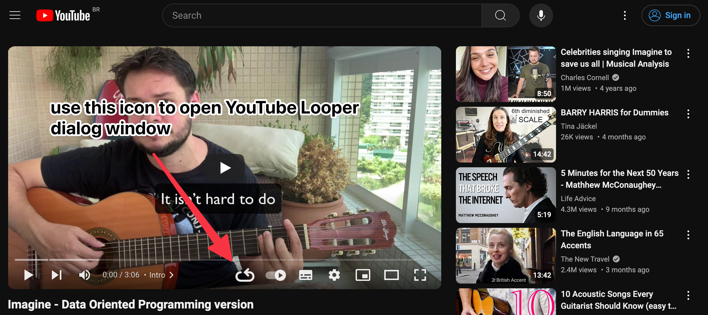
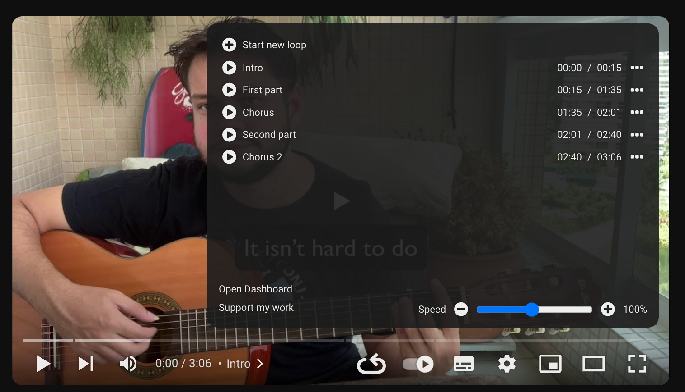
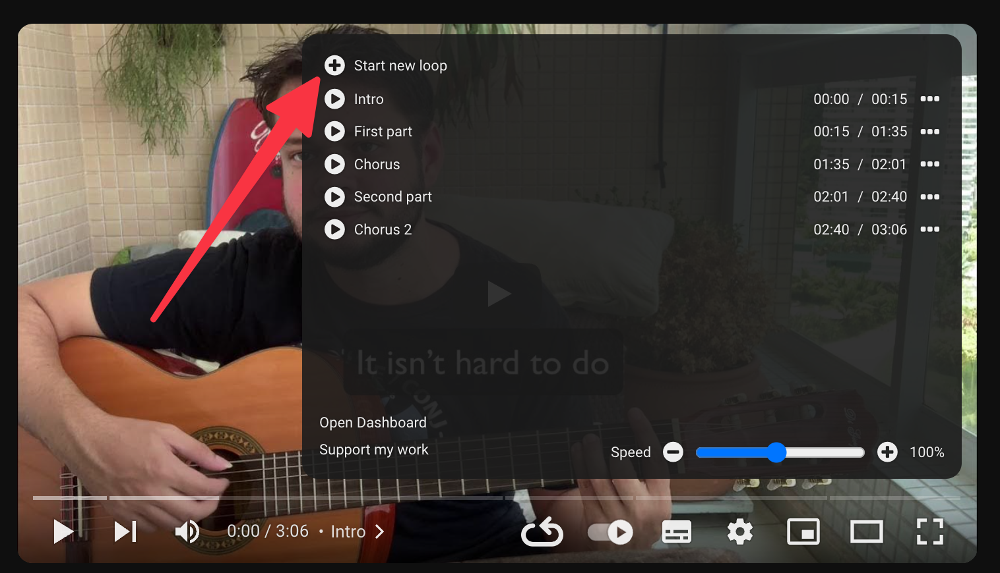
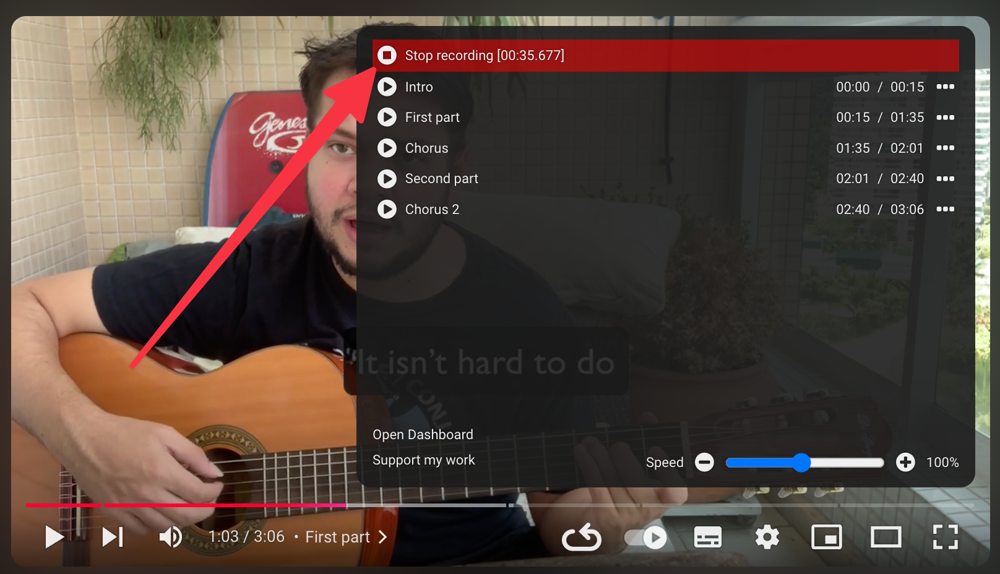
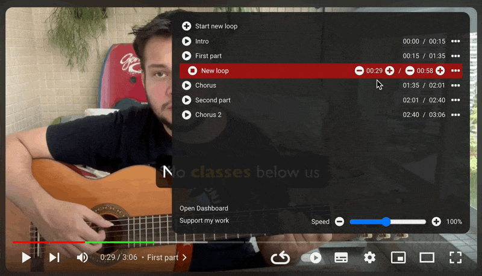
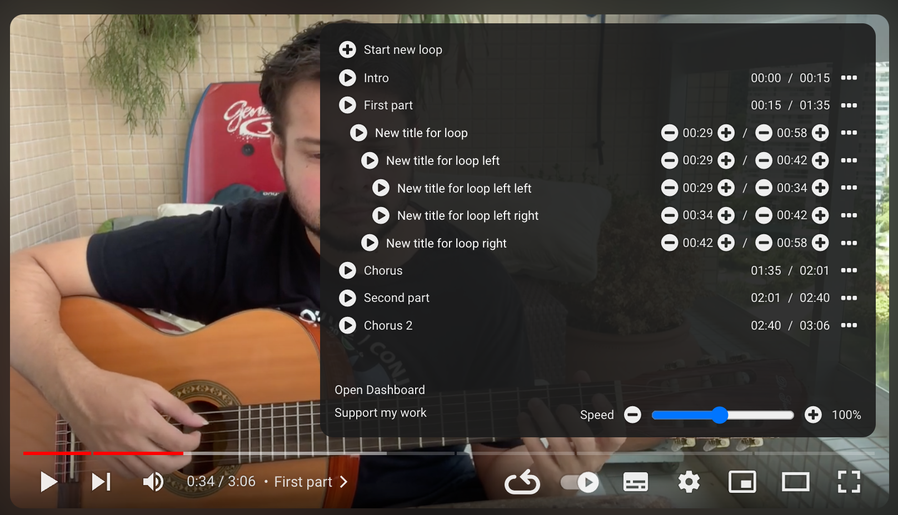
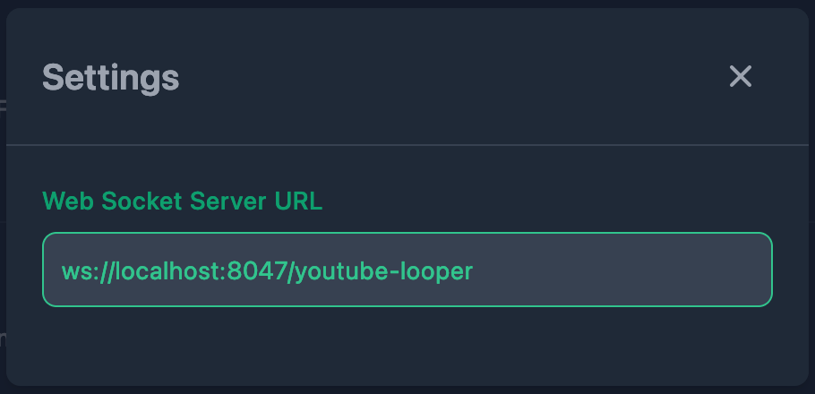
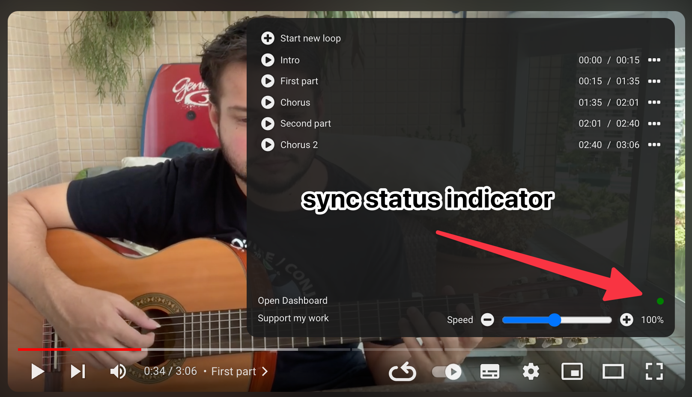

# YouTube Looper

This repository contains the source code for the YouTube looper extension.

## Install

You can install the extension from the [Chrome Web Store](https://chrome.google.com/webstore/detail/youtube-looper/bidjeabmcpopfddfcnpniceojmkklcje?hl=en-US&utm_source=chrome-ntp-launcher).

## Using the extension

The extension adds a new button into the YouTube player video toolbar:



When a video has chapters (like in this example), YouTube Looper will automatically create a loop on each chapter:



### Creating a loop

When you start a new loop, the current video time will be the start time of a loop. You can start a loop with the video
running or paused.



Once you mark the start point of the loop, you will see an indication of the time it started, and the `+` button gets
replaced with a stop button:



After click to stop, the new loop will be recorded and will be activated.

#### Update loop label

Naming your loops will really help you later to remember what that section is about. You can click on the loop label
to edit it:



The label is automatically saved as you type. Hit return or escape to remove the focus from label input.

#### Adjust loop timing

You can edit the loop timing after it has been created. For this task you can use the `-` and `+` buttons around the
timings. The buttons will adjust the timing by one second on each click. If you hold the `shift` key, you can do a 
precise adjustment, that iterates in 100ms offsets.

You can also click in the time to edit as a text.

### Tree View

When a loop time is contained inside the range of another loop, this loop will be displayed as a child of the parent
loop. This is common when you want, for example, to break a section to train in smaller sections and later go wider.
If there are many levels of nesting, the loops will indent accordingly.



### Loop actions

On the right side of each loop you can see a `...`, mouse over it to reveal the actions for that loop.

### Duplicate loop

Use the duplicate action to create a copy from the loop.

### Delete loop

Click on this action to delete the loop. Loops created from markers can't be deleted.

### Split loop

Split loop will create two loops by splitting the selected loop at the current video time. The split action only shows
when the current time of the video is inside the boundaries of the loop you are seeing the actions for.

### Speed control

The speed control at the lower right of the panel allows you to have precise control over the video playback speed.
Click on the label `Speed` to return it to 100%.

## Keyboard shortcuts

* `alt+z` - Start loop recording
* `alt+z` - End loop recording (after started)
* `alt+z` - Seek to begin of loop (when loop is active)
* `alt+shift+z` - Seek to begin of loop minus 3 seconds (when loop is active)

## Popup Window

You can open the popup window by clicking on the YouTube Looper icon in the Chrome toolbar:

IMAGE

The popup window gives a link to access the dashboard, and also displays the last four videos you have played a loop on.

## Dashboard

In the dashboard page you can see all the videos you have recorded loops for. Use the search input to find some video.

### Export

Use the export button to save all your loops in a file that you can use to restore later, or to copy to a different
installation, or share loops with friends.

### Import

Here you can import files created using the export feature. You will see an import preview to see what you are 
importing.

### Import from the previous version

### Settings

Currently, the only setting is to configure a sync service. This is an advanced topic and only recommended to people
with some programming experience. You have to set up a service, that can run on your machine or somewhere that's
accessible in the network.

## Running a sync server

This version of the YouTube Looper uses [TinyBase](https://tinybase.org/) as the data layer. 
If you have multiple devices or want to back up your data locally; you can run a server and connect to it!

You're going to need to have some developer tools installed on your machine:

- Bun
- Git

Download and run the server:

```
git clone https://github.com/wilkerlucio/youtube-looper-server.git
cd youtube-looper-server
bun run index.ts
```

After that, open the settings in the extension dashboard and paste this in the URL for the WebSocket connection:

```
ws://localhost:8047/youtube-looper
```

The background will turn green when the connection is successfully made.



### Status on modal

When you have sync turned on, you will notice a circle in the bottom area of the modal:



The green circle means the connection is working and your data is synced. If you see a red dot, go to the dashboard
page and check your configuration.

### Backing up data

One way to back up the data from the server is to back up the files at `server-storage` folder.
There will be a JSON file called `youtube-looper.json` if you followed the configuration described above.

## Developing the extension

If you like to develop the extension, make sure you have `pnpm` installed, and them:

```
pnpm i
pnpm run dev
```

This will start the compilation and open the browser in an anonymous profile with the extension in dev mode installed
on it.

## Building extension

To build releases:

```
# for chrome
pnpm run zip

# for firefox
pnpm run zip:firefox
```
